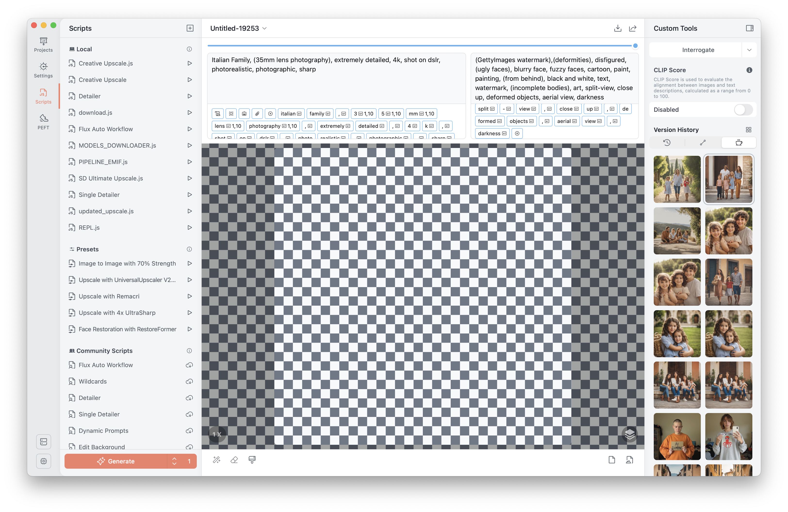
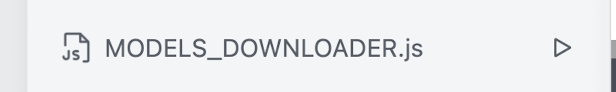

# EMIF_Reloaded_UI

**Important:**  
Create the virtual environment with **Python 3.12** or it will **NOT display a shit**.

## Overview

EMIF_Reloaded_UI is a user interface project designed to integrate and streamline the image generation, cutting, and grid creation processes. This project builds upon TDL emif concepts and incorporates new features and aesthetic customizations for an improved user experience.

## Features

- **Dynamic UI:**  
  Replace the preset nation selection with an open field to allow free-form input.

- **Model Offloading:**  
  Download models via URL to decrease local storage requirements and facilitate updates.

- **Enhanced Troubleshooting:**  
  Updated troubleshooting procedures for new environment issues.

- **Internal Check-Ins:**  
  Automated readiness checks for models before processing.

- **macOS Specifics:**  
  Custom macOS icon creation to provide a native look and feel.

- **Aesthetic Customization:**  
  Tailor the UI styling and design to meet specific branding or usability requirements.

## Requirements

- **Python:**  
  Python 3.12 is required.  
  _Ensure you create your virtual environment using Python 3.12._

- **Dependencies:**  
  Install all Python package dependencies (listed in `requirements.txt`).

## Setup

1. **Clone the Repository:**

   ```bash
   git clone https://github.com/yourusername/EMIF_2.0.git
   cd EMIF_2.0
   ```

2. **Create a Virtual Environment with Python 3.12:**

   ```bash
   python3.12 -m venv venv
   source venv/bin/activate  # On macOS/Linux


   venv\Scripts\activate     # On Windows
   ```

3. **Install Dependencies:**

   ```bash
   pip install -r requirements.txt
   ```

4. **Setupping DrawThings:**

Open the drawthings app. The following script utilizes a mixture of Nets and models. To ensure the models are loaded to your drawthings

Go to the "scripts" panel in the left menu



Create a new script: "Downloader".
Paste this code:

```js
pipeline.downloadBuiltins([
  "4x_ultrasharp_f16.ckpt",
  "sd_xl_base_1.0_f16.ckpt",
  "sd_xl_refiner_1.0_f16.ckpt",
  "controlnet_tile_1.x_v1.1_f16.ckpt",
  "juggernaut_reborn_q6p_q8p.ckpt",
  "add_more_details__detail_enhancer___tweaker__lora_f16.ckpt",
  "sdxl_render_v2.0_lora_f16.ckpt",
  "tcd_sd_v1.5_lora_f16.ckpt",
]);
```

Run the script.
<br><br>

You will now see a downloading interface with the models, controlNets and Loras being downloaded.

6. **Enable API endpoint:**

**NB:** The _API SERVER_ option of Drawthings app must be activated and the port must be set to  
<br><br> `127.0.0.1:7860` in order to work properly.

5. **Usage:**

After setting up the environment as before, you can start the application as follows:

```bash
python main.py
```

# Application itself

## Image generation

The image generation panel works by defining a queue of operations to be fed to the [Drawthings app](https://apps.apple.com/it/app/draw-things-ai-generation/id6444050820?l=en-GB).


So just create the queue and launch the generation. On the right window you will be updated with the last image generated.

The nationality and the category will be combined to create a prompt that will look like this:

```python
prompt = f"{Nationality} {Category}, (35mm lens photography), extremely detailed, 4k, shot on dslr, photorealistic, photographic, sharp"
```

Everything that's there except from the Nationality and Category is due to the need of photorealistic outputs.

## Image cutting

## Grid creator

## ToDoList

- [x] Test script on fresh environment
- [ ] Add photoshop file building support
- [x] Check input field open
- [ ] Customize UI?
- [x] Add check for models and force download them if necessary
